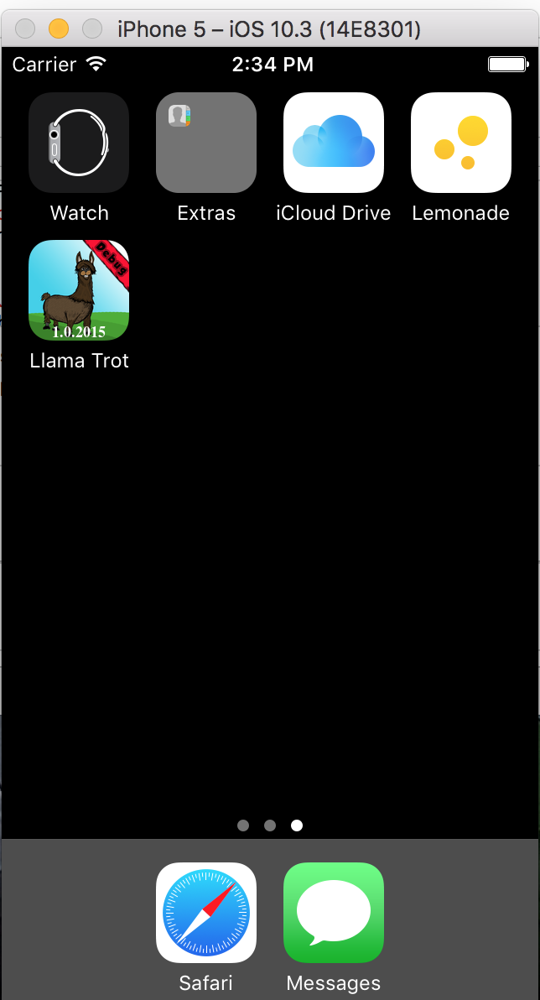
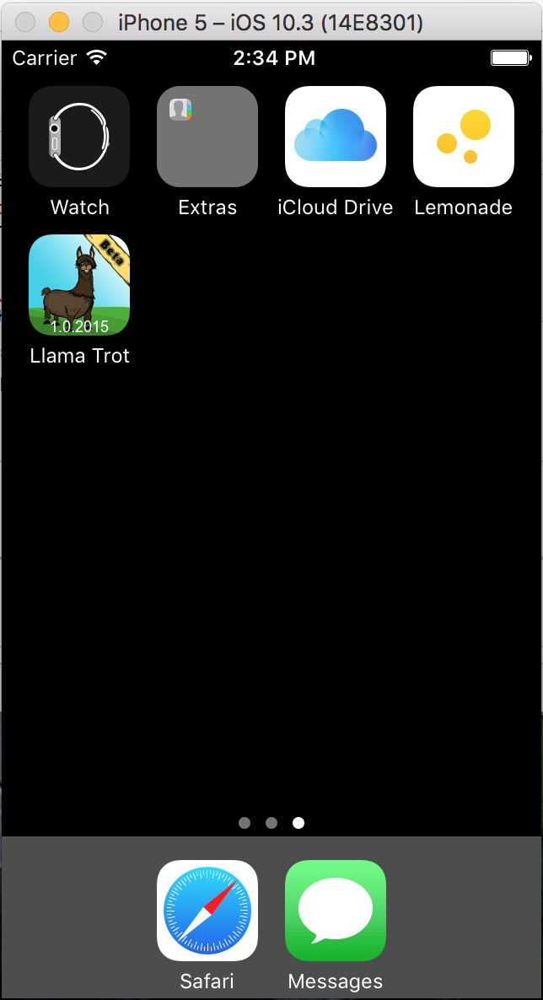
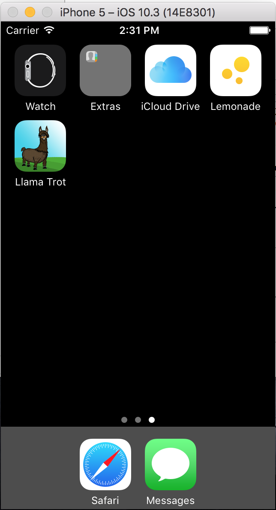

Llama Trot
==========
So, you’ve finished a beta version of your app, and finally there are some fresh eyeballs and brains helping you test and perfect the app that’s going to make you rich…or at least fatten your portfolio.

But wouldn’t it be helpful if testers had an easy way to check which build version of the app they have?

This tutorial will show you how to do that, and perhaps introduce you to a few lesser-known features of Xcode.

## Screenshots

---
Source: [How To Change Your App Icon at Build Time](https://www.raywenderlich.com/105641/change-app-icon-build-time)